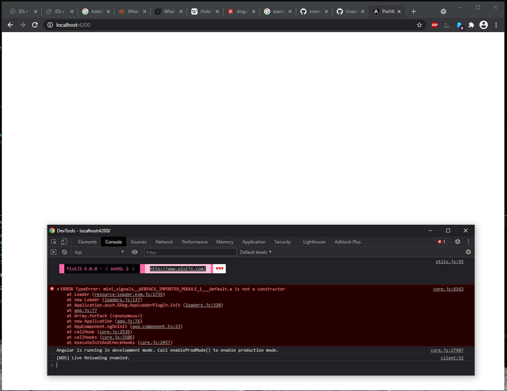
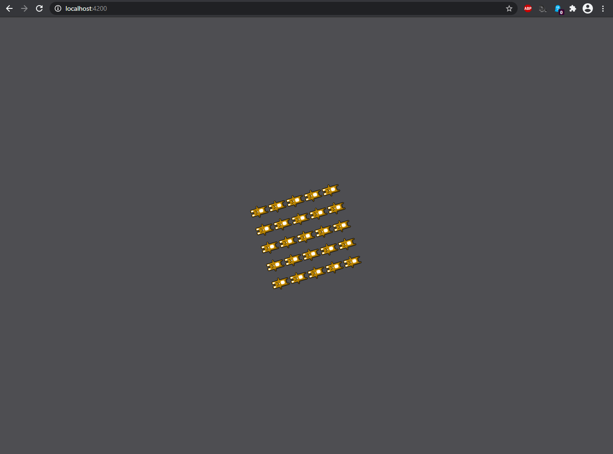

# PixiV6

## Usage

1. Install deps with `npm i`

2. Start the server with `npm start`

3. Navigate to `localhost:4200`

4. Open dev tools, see the error

```
ERROR TypeError: mini_signals__WEBPACK_IMPORTED_MODULE_1___default.a is not a constructor
    at Loader (resource-loader.esm.js:1735)
    at new Loader (loaders.js:137)
    at Application.push.XXeg.AppLoaderPlugin.init (loaders.js:320)
    at app.js:77
    at Array.forEach (<anonymous>)
    at new Application (app.js:76)
    at AppComponent.ngOnInit (app.component.ts:23)
    at callHook (core.js:2535)
    at callHooks (core.js:2506)
    at executeInitAndCheckHooks (core.js:2457)
```

This is what you should see after it is started:



# pixi.js v5

If you downgrade to v5, the application works without a problem. To do this:

1. Stop the server

2. Run `npm i pixi.js@^v5.3`

3. Remove the following from the `tsconfig.json`:

```json
"paths": {
    "mini-signals": ["node_modules/resource-loader/typings/mini-signals.d.ts"]
}
```

5. Start the app with `npm start`

6. Navigate to `localhost:4200` and you should see the following:


